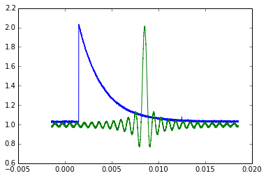
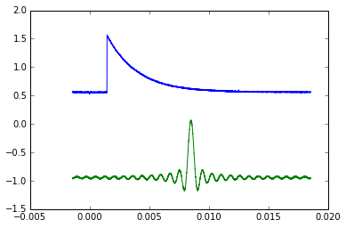

### Demonstration

Controlling output channels on a 2 channel Tek3102 function generator, and measuring the waveforms on a Tek3034 oscilloscope.


```python
%matplotlib inline
import numpy as np
import matplotlib.pyplot as plt
import visa
```


```python
import wanglab_instruments as wl
```


```python
# Tek3102 on GPIB address 4
# Tek3034 on GPIB address 20
rm = visa.ResourceManager()
rm.list_resources()
```


    (u'TCPIP0::10.10.1.128::INSTR',
     u'GPIB0::1::INSTR',
     u'GPIB0::4::INSTR',
     u'GPIB0::8::INSTR',
     u'GPIB0::11::INSTR',
     u'GPIB0::15::INSTR',
     u'GPIB0::19::INSTR',
     u'GPIB0::20::INSTR',
     u'GPIB0::21::INSTR')


```python
# Create 2 instances of Tek3102, one for each channel, with default frequency unit in Hz
afg1 = wl.function_generators.Tek3102(rm.open_resource('GPIB0::4::INSTR'),freq_unit='Hz')
afg2 = wl.function_generators.Tek3102(rm.open_resource('GPIB0::4::INSTR'),freq_unit='Hz', channel=2)
```


```python
# View the objects to make sure they have the correct attributes
print(afg1)
print(afg2)
```

    Tek3102(<'GPIBInstrument'(u'GPIB0::4::INSTR')>, 'Hz', 'V', channel=1)
    Tek3102(<'GPIBInstrument'(u'GPIB0::4::INSTR')>, 'Hz', 'V', channel=2)


```python
# Creat Tek3034 scope object
scope = wl.oscilloscopes.Tek3034(rm.open_resource('GPIB0::20::INSTR'))
```


```python
# View valid waveforms
help(afg1.set_waveform)
```

    Help on method set_waveform in module wanglab_instruments.function_generators:
    
    set_waveform(self, wave, channel=None) method of wanglab_instruments.function_generators.Tek3102 instance
        set_waveform(self,wave,channel=None):        
        
        set the value of waveform        
        valid waveforms:
           { SINusoid|SQUare|PULse|RAMP|PRNoise|DC|SINC|GAUSsian|LORentz|
           ERISe|EDECay|HAVersine|USER[1]|USER2|USER3|USER4|EMEMory|EFILe }
        
        Args:
            wave (str) : one of valid waveforms
            channel (int, optional) : { 1 | 2 }
        
        Returns:
            None
    


```python
# Set channel 1 to sinc waveform w/ 40 Hz frequency and turn on the channel
afg1.waveform = 'SINC'
afg1.frequency = 40
afg1.output(1)
```


```python
# Set channel 2 to decaying exponential with same frequency as channel 1, turn on the channel
afg2.waveform = 'EDEC'
afg2.frequency = afg1.frequency
afg2.output(1)
```


```python
# Collect waveforms from scope
ch3 = scope.fetch_spectrum(3)
ch4 = scope.fetch_spectrum(4)
```


```python
plt.plot(ch3[0],ch3[1])
plt.plot(ch4[0],ch4[1])
```


    [<matplotlib.lines.Line2D at 0x6487130>]





```python
# We can also collect the waveforms as they are seen on the scope display, which includes an adjustable
# verticle offset
ch3_off = scope.fetch_spectrum(3,offset=True)
ch4_off = scope.fetch_spectrum(4,offset=True)
```


```python
plt.plot(ch3_off[0],ch3_off[1])
plt.plot(ch4_off[0],ch4_off[1])
```


    [<matplotlib.lines.Line2D at 0x64870d0>]




